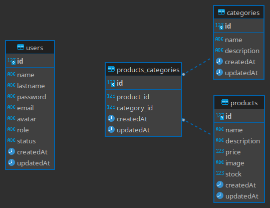

# ECOMMERCE BASIC

## Description

This is a test for a company made by Sergio Duran.

It is a simple e-commerce made with ExpressJs and ReactJs *(If I have time)*.

Yup maybe I am being a little ambitious, but I want to learn more about ExpressJs and I think this is a good opportunity to do it.

Update: I did not have time to do the frontend, but I did the backend with the basic requirement, so I will leave the documentation here.

## Installation

### Requirements

- NodeJs v18.14.0
- NPM v9.2.0
- PostgreSQL
- Docker *(Optional)*
- Docker Compose *(Optional)*

### Steps

1. Clone the repository
2. Enter de api folder with 
    ~~~ bash
    cd api
    ~~~
2. Install the dependencies with 
    ~~~ bash
    npm install
    ~~~
3. Create a database in PostgreSQL
4. Create a `.env` file in the api folder with the following content:
    ~~~ bash
    touch .env
    vim .env
    ~~~
    ~~~ vim
    DB_HOST=localhost
    DB_USER=postgres
    DB_PASSWORD=postgres
    DB_NAME=ecommerce
    DB_PORT=5432
    PORT=3000
    API_KEY=secret
    ~~~

## Usage

### Development

To run the project in development mode run `npm run dev` in the api folder.

### Production

To run the project in production mode, run `npm start` or `npm run start` in the api folder.

if you want to run the project with docker, run `docker-compose build` and then `docker-compose up` in the root of the project.

## Documentation

You can find the documentation of the API in the following link: [API Documentation](https://app.swaggerhub.com/apis/sradium/test-sergio-duran/1.0.0) or you can import the `swagger.json` file in swagger.

Alternatively you can run the project and go to `http://localhost:3000/api/v1/docs/` to see the documentation.

## Routes

base prefix: `/api/v1`

### Auth

- `POST /auth/login` - Login
- `POST /auth/register` - Register
- `GET /auth/me` - Get the current user

### Products

- `GET /products` - Get all products
- `GET /products/:id` - Get a product by id
- `GET /products/:id/categories` - Get all categories of a product
- `POST /products` - Create a product
- `PUT /products/:id` - Update a product by id
- `DELETE /products/:id` - Delete a product by id

### Categories

- `GET /categories` - Get all categories
- `GET /categories/:id` - Get a category by id
- `GET /categories/:id/products` - Get all products of a category
- `POST /categories` - Create a category
- `POST /categories/:id/products` - Add a product to a category
- `PUT /categories/:id` - Update a category by id
- `DELETE /categories/:id` - Delete a category by id

## Models

### User:
    Name: String
    Email: String
    Password: String
    Avatar: String
    Role: String
    Status: String
    Created At: Date
    Updated At: Date

### Category:
    Name: String
    Description: Text
    Created At: Date
    Updated At: Date

    has_many :products, through: :product_categories

### Product:
    Name: String
    Description: Text
    Price: Float
    Stock: Integer
    Image: String
    Created At: Date
    Updated At: Date

    has_many :categories, through: :product_categories

### ProductCategory:
    Product: Reference
    Category: Reference
    Created At: Date
    Updated At: Date

    belongs_to :product
    belongs_to :category
